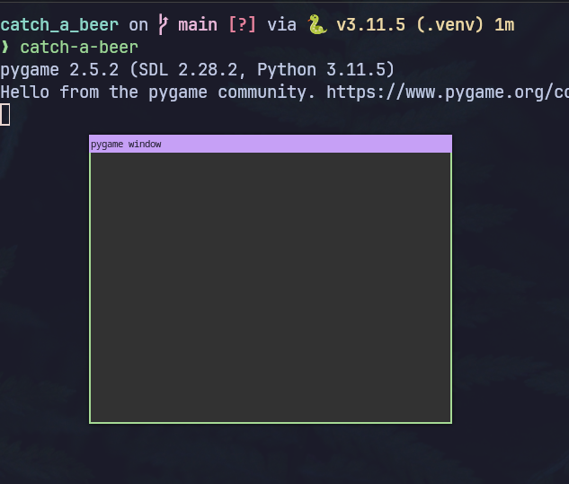

# Catch a Beer

## Criando um jogo com Python e pygame

Vamos criar um jogo simples usando Pygame, uma das mais conhecidas bibliotecas
para games 2D em Python.

> **Aviso**: Não sou game developer, minha intenção é apenas mostrar
> a funcionalidade básica do Pygame e talvez te inspirar a criar um jogo.
> Fique a vontade para usar este código como base para seu próprio jogo,
> e se fizer por favor mande um PR adicionando suas melhorias, leia o arquivo
> `CONTRIBUTING.md` para saber como contribuir com a sua versão.

## Estrutura do Projeto

Vamos criar o diretório principal do projeto e alguns arquivos iniciais.

```bash
$
mkdir -p src/catch_a_beer/assets/game/{beers,player,sound}
touch src/catch_a_beer/{game,__init__}.py
touch pyproject.toml
```

Vamos começar editando o arquivo `pyproject.toml` que irá descrever os metadados 
do projeto e além disso vai conter a lista de dependencias a serem instaladas.

`$EDITOR pyproject.toml`
```toml
[project]
name = "catch_a_beer"
requires-python = ">=3.10"
version = "0.1.0"
dependencies = ["pygame"]

[project.scripts]
catch-a-beer="catch_a_beer.game:main"

[build-system]
requires = ["setuptools>=45"]
build-backend = 'setuptools.build_meta'
```

Agora vamos editar o arquivo principal do jogo o `src/catch_a_beer/game.py` e adicionar
apenas a função de entrada.

`$EDITOR src/catch_a_beer/game.py`
```python
def main():
    print("Game!")
```

Esta é a função onde tudo vai acontecer mas antes vamos nos certificar de que 
tudo está funcionando corretamente.

## Setup do ambiente

Começamos criando um ambiente virtual

```bash
$
python -m venv .venv
source .venv/bin/activate
```

Agora instalamos o projeto em modo editável.

```bash
$ 
pip install -e .

Obtaining file:///~/Projects/catch_a_beer
Collecting pygame (from catch-a-beer==0.1.0)
Successfully built catch-a-beer
Installing collected packages: pygame, catch-a-beer
Successfully installed catch-a-beer-0.1.0 pygame-2.5.2
```

E agora podemos executar

```bash
$ 
catch-a-beer
Game!
```

## Pygame

O Pygame é um wrapper para a SDL Library (Simple DirectMedia Layer) que  é uma
maneira de desenvolver aplicações graáficas multi plataforma.

Para certificar-se de que o Pygame está instalado corretamente pode executar um
de seus exemplos.

```bash
$
python -m pygame.examples.aliens    
```

Assim que você perder nesse jogo (meu máximo foi 46) vamos começar a entender
como o Pygame funciona.

## Janela principal

O nosso jogo será um jogo simples de apenas uma janela, portanto saremos apenas
a janela principal do Pygame, para iniciar uma janela no Pygame edite o `game.py`

`$EDITOR src/catch_a_beer/game.py`  
```python
import pygame as pg


def main():
    pg.init()  # Inicia o pygame
    window = pg.display.set_mode((400, 300))  # cria uma janela de 400x300
    window.fill((50, 50, 50))  # Preenche da cor RGB cinza
    pg.display.update()  # Refresh
    input()  # Espera input do usuário
```

Ao executar no terminal `$ catch-a-beer` verá uma janela cinza vazia flutuar na
sua tela, esse é o nosso canvas, onde iremos desenhar os elementos do jogo.



basta fechar ou digitar qualquer tecla no teminal que a janela se fecha.

## Frames

Neste exemplo usamos a chamada de `input` para forçar a espera de um input 
do usuário antes de encerrar o programa e fechar a tela.

> Experimente remover a última linha contendo `input()` para ver o que acontece,
> o programa irá executar tão rapidamente que quase não será possível ver a tela.

Para criar uma animação, um jogo, ou até mesmo um programa com formulários e
textos, precisamos constantemente atualizar os elementos exibidos na tela.

Imagine um `flip book`, aqueles livrinhos animados onde cada página (frame) tem
um movimento diferente, dando a impressão de que as coisas estão se movendo.


Agora considere que o objeto `pg` é o livro, o objeto `window` é cada página 
em branco que podemos desenhar livremente e para mudar de página, chamamos
o método `pg.display.update()` que redesenha todos os elementos na tela.

Para ficar mais fácil de entender vamos a um exemplo interativo.


```python
import pygame as pg


def main():
    pg.init()
    window = pg.display.set_mode((400, 300))

    # Página 1
    window.fill((50, 50, 50))  # Cinza
    pg.display.update()
    input()
    # Página 2
    window.fill((60, 220, 0))  # Verde
    pg.display.update()
    input()
    # Página 3
    window.fill((255, 240, 60))  # Amarelo
    pg.display.update()
    input()
```

Execute o jogo e veja que a cada vez que digitar qualquer caractere no terminal
a janela do jogo será atualizada como se estivessmos virando a página.


Cada "virada de página" é o que vamos chamar de **frame**, só que em um jogo o
usuário nem sempre vai precisar digitar ou clicar para mudar para o próximo,
geralmente os frames mudam automaticamente e muitas vezes por segundo, na maior
parte dos jogos 2D como esse, os frames operam em 30 ou 60fps (frames por segundo)

## Loop de eventos

Agora que já falamos sobre frame vamos falar da necessidade de manter os frames
sendo atualizados constantemente, ou seja, manter as páginas virando para criar
o efeito de animação, como no flip-book.

Em alguns tipos de jogos é preciso manter uma certa cadência dessa mudança de 
frames, por exemplo, computadores mais antigos, não conseguem atualizar a tela
muitas vezes por segundo, mas na maioria dos dispositivos modernos isso não é
um problema. Outro motivo para manter um padrão de atualização é para tornar
mais fácil e padronizado alguns cálculos que precisamos fazer dentro do jogo.

No pygame é possível controlar o FPS usando uma chamada ao `pg.clock.tick(30)`
neste exemplo estariamos definindo 30 FPS.

Mas em nosso jogo, como ele é bastante simples, não precisaremos nos preocupar
com isso, nós vamos atualizar a nossa tela a maioria das vezes quanto for 
possível e a cada mudança de frame nós vamos redesenhar elementos na tela e
reagir a eventos do jogador.

Para fazer isso vamos manter um `loop de eventos` e a forma mais fácil de fazer
isso em Python é usando um simples `while`.

Portanto vamos alterar o jogo para ser algo assim:

```python
import pygame as pg
import pygame.locals as keys


class Size:
   BASE = (800, 800)


class Color:
    BLACK = (0, 0, 0)
    WHITE = (255, 255, 255)
    GREEN = (60, 220, 0)
    YELLOW = (255, 240, 60)
    GRAY = (50, 50, 50)


def main():
    # Setup gaming window
    pg.init()
    window = pg.display.set_mode(Size.BASE)
    window.fill(Color.GRAY)
    pg.display.update()

    # Event loop
    running = True
    while running:
        # Capture keys pressed
        for event in pg.event.get(keys.KEYDOWN):
            match event.key:
                case keys.K_LEFT:
                    window.fill(Color.GREEN)
                case keys.K_RIGHT:
                    window.fill(Color.YELLOW)
                case keys.K_UP:
                    window.fill(Color.BLACK)
                case keys.K_DOWN:
                    window.fill(Color.WHITE)
                case keys.K_ESCAPE:
                    running = False
                                      

        # Always update the window at the end of the loop
        pg.display.update()
```

Ao executar desta vez você verá uma tela maior em cor cinza e apesar de não dar
para perceber a tela estará sendo atualizada a cada volta do loop e reagindo a
eventos das teclas direcionais do teclado para mudar de cor, e esc para sair.


O Pygame permite capturar alguns tipos de eventos no loop com `pg.event.get` e
como nosso jogo será jogado apenas com o teclado nós vamos nos preocupar apenas
com as teclas que serão pressionadas e de acordo com esses eventos mudaremos
o estado do jogo.

## Cenário

Nós vamos reutilizar o cenário contido em um dos exemplos do Pygame que é uma visão
superior de uma estrada, com este cenário é possível desenvolver jogos de corrida,
ou qualquer outro tipo de jogo onde velocidade e colisão sejam a base da jogabilidade.


Vamos definir os paramêtros do cenário através de algumas constantes, ao invés
de setarmos os valores fixos conforme a imagem acima iremos utilizar valores
proporcionais pois desta forma permitimos o redimensionamento da janela.

É importante que todas as posições fixas que não dependam de cálculo durante o
jogo sejam definidas em constantes.

`src/catch_a_beer/game.py:Size`

```python
class Size:
    BASE = WIDTH, HEIGHT = (800, 800)
    ROAD = int(WIDTH / 1.6)  # 500
    SEP = int(WIDTH / 200)  # 4

class Point:
    CENTER_RIGHT = Size.WIDTH / 2 + Size.ROAD / 4  # 525
    CENTER_LEFT = Size.WIDTH / 2 - Size.ROAD / 4  # 275
    BORDER_RIGHT = Size.WIDTH / 2 + Size.ROAD / 2  # 650
    BORDER_LEFT = Size.WIDTH / 2 - Size.ROAD / 2  # 150
    MIDDLE = Size.WIDTH / 2 - Size.SEP / 2  # 398

class Position:
    TOP_RIGHT = (Point.CENTER_RIGHT, Size.HEIGHT * 0.2)
    TOP_LEFT = (Point.CENTER_LEFT, Size.HEIGHT * 0.2)
    BOTTOM_RIGHT = (Point.CENTER_RIGHT, Size.HEIGHT * 0.8)
    BOTTOM_LEFT = (Point.CENTER_LEFT, Size.HEIGHT * 0.8)
```

Vamos também alterar a cor inicial de cinza para verde no inicio da funçao `main`

```diff
- window.fill(Color.GRAY)
+ window.fill(Color.GREEN)
```

Com essa definição podemos agora desenhar os elementos fixos da tela, lembrando
que assim como em um flip-book iremos redesenhar a tela completamente a cada
volta do loop.

```python
def main():
    # Setup gaming window
    pg.init()
    window = pg.display.set_mode(Size.BASE)
    window.fill(Color.GREEN)
    pg.display.update()

    # Event loop
    running = True
    while running:
        # Capture keys pressed
        for event in pg.event.get(keys.KEYDOWN):
            match event.key:
                case keys.K_ESCAPE:
                    running = False

        # Draw the road in the middle
        pg.draw.rect(window, Color.GRAY, (Point.BORDER_LEFT, 0, Size.ROAD, Size.HEIGHT))

        # Always update the window at the end of the loop
        pg.display.update()
```

Até aqui só desenhamos a primeira camada do cenário mas já temos um resultado mais
interessante:


Agora vamos completar os outros elementos do cenário, sendo que o código completo
seja:

```python
import pygame as pg
import pygame.locals as keys

class Size:
    BASE = WIDTH, HEIGHT = (800, 800)
    ROAD = int(WIDTH / 1.6)
    SEP = int(WIDTH / 200)

class Point:
    CENTER_RIGHT = Size.WIDTH / 2 + Size.ROAD / 4
    CENTER_LEFT = Size.WIDTH / 2 - Size.ROAD / 4
    BORDER_RIGHT = Size.WIDTH / 2 + Size.ROAD / 2
    BORDER_LEFT = Size.WIDTH / 2 - Size.ROAD / 2
    MIDDLE = Size.WIDTH / 2 - Size.SEP / 2

class Position:
    TOP_RIGHT = (Point.CENTER_RIGHT, Size.HEIGHT * 0.2)
    TOP_LEFT = (Point.CENTER_LEFT, Size.HEIGHT * 0.2)
    BOTTOM_RIGHT = (Point.CENTER_RIGHT, Size.HEIGHT * 0.8)
    BOTTOM_LEFT = (Point.CENTER_LEFT, Size.HEIGHT * 0.8)

class Color:
    BLACK = (0, 0, 0)
    WHITE = (255, 255, 255)
    GREEN = (60, 220, 0)
    YELLOW = (255, 240, 60)
    GRAY = (50, 50, 50)

def main():
    # Setup gaming window
    pg.init()
    window = pg.display.set_mode(Size.BASE)
    window.fill(Color.GREEN)
    pg.display.update()

    # Event loop
    running = True
    while running:
        # Capture keys pressed
        for event in pg.event.get(keys.KEYDOWN):
            match event.key:
                case keys.K_ESCAPE:
                    running = False

        # Draw the road in the middle
        pg.draw.rect(window, Color.GRAY, (Point.BORDER_LEFT, 0, Size.ROAD, Size.HEIGHT))
        # Draw Separator
        pg.draw.rect(window, Color.YELLOW, (Point.MIDDLE, 0, Size.SEP, Size.HEIGHT))
        # Draw borders
        pg.draw.rect(window, Color.WHITE, (Point.BORDER_LEFT + Size.SEP * 2, 0, Size.SEP, Size.HEIGHT))
        pg.draw.rect(window, Color.WHITE, (Point.BORDER_RIGHT - Size.SEP * 3, 0, Size.SEP, Size.HEIGHT))

        # Always update the window at the end of the loop
        pg.display.update()
```


## Texto e estado

Além do cenário que é estático, teremos elementos dinâmicos no jogo, por exemplo,
teremos um título contendo a pontuação atual, jogador e inimigos.

Para que esses elementos sejam animados durante o jogo precisamos manter o estado,
que é simplesmente a maneira de armazenar e atualizar a cada frame a posição e o valor
dos elementos.

Para escrever na tela vamos usar uma `SysFont` que carrega uma fonte instalada no
sistema e então defiremos suas propriedades em uma estrutura `FontProperties`.

Para controlar o estado vamos criar uma estrutura `Game` onde armazenaremos a
contagem de rodadas, ganhos, perdas, flags indicando se o jogo está executando ou
em modo pausa.


> "Nunca hesite em sacrificar o preciosismo em favor da clareza" -- Greg Wilson, Teach Tech Together

> **NOTA**: Estamos propositalmente usando classes apenas como estrutura de dados
> isso é intencional para evitar abstração excessiva já que o intuito deste material
> não é fazer o código mais perfeito mas sim mostrar proceduralmente como um jogo
> funciona, depois de entender os conceitos e finalizar o jogo, fique a
> vontade para refatorar encapsulando comportamento e mudança de estado em métodos
> de instâncias.


Logo antes da função `main`:
```python
class FontProperties:
    FAMILY = "Comic Sans MS"
    NORMAL = FAMILY, 30
    BIG = FAMILY, 90

class Game:
    rounds: int = 0
    gains: int = 0
    losses: int = 0
    running: bool = True
    paused: bool = False
    speed: int = 1
```

E faremos pequenas mudanças dentro da função `main` começando na condição de parada do loop.

```diff
def main():
    ...
+   normal_font = pg.font.SysFont(*FontProperties.NORMAL)
+   big_font = pg.font.SysFont(*FontProperties.BIG)
    # Event loop
-   running = True
-   while running:
+   while Game.running:
+       Game.rounds += 1
```
E no final da função `main` podemos agora escrever o nosso texto, para isso vamos
usar o método `render` da fonte e para colocar na tela usaremos o `window.blit` que
desenha na tela de forma similar a que usamos com o `draw`.

> **CURIOSIDADE**: BLIT é uma sigla combinada para BLock bIt Tranfer, a operação de
> combinar 2 bitmaps em um, em nosso caso a janela com o cenário desenhado e o texto
> que será escrito por cima.

```diff
def main():
    ...
    while Game.running:
        ...
+       # Game title
+       title = normal_font.render(f"Catch a beer! bebeu: {Game.gains} vacilou: {Game.losses}", 1, Color.WHITE, Color.BLACK)
+       window.blit(title, (Size.WIDTH / 5, 0))
        # Always update the window at the end of the loop
```


## Assets

Um jogo precisa de `assets` que são os arquivos estáticos como imagens e arquivos
de áudio que serão carregados durante o jogo, vamos colocar os assets no 
diretório `src/catch_a_beer/assets/` e para facilitar você pode executar o
seguinte script que vai baixar os arquivos do github, ou se preferir pode
copiar diretamente do repositório em https://github.com/rochacbruno/catch_a_beer

```bash
bash -c "$(curl -fsSL https://raw.githubusercontent.com/rochacbruno/catch_a_beer/main/get_assets.sh)"
```


No topo do arquivo vamos criar constantes definindo caminhos para os arquivos de assets.

```diff
import pygame as pg
import pygame.locals as keys
+from pathlib import Path
+
+DIR = Path(__file__).parent.absolute()
+ASSETS = DIR / "assets/game/"
+SOUNDS = ASSETS / "sound"
+PLAYER = ASSETS / "player"
+BEERS = ASSETS / "beers"
```

Agora vamos começar posicionando e animando alguns assets na janela,
começaremos criando uma função que a cada vez que for chamada irá retornar
um asset de `BEERS` no topo do nosso cenário, e então dentro da função `main`
vamos criar os objetos `beer` e `beer_position` e a cada volta do loop vamos
incrementar a posição Y da cerveja de acordo com a valocidade estabelecida para
que cause a animação da cerveja caindo.

```diff
+import random
import pygame as pg
...

+def load_random_beer() -> tuple[pg.Surface, tuple[float, float]]:
+    """Returns a tuple containing a random asset surface."""
+    i = random.randint(1, 5)
+    beer = pg.image.load(BEERS / f"{i}.png")
+    beer = pg.transform.scale(beer, (100, 100))
+    beer_position = beer.get_rect()
+    beer_position.center = Position.TOP_RIGHT if random.randint(0, 1) == 0 else Position.TOP_LEFT
+    return beer, beer_position
+
+
def main():
    ...
+   beer, beer_position = load_random_beer()
    # Event loop
    while Game.running:
        Game.rounds += 1
+       beer_position[1] += Game.speed
        ...
+       window.blit(beer, beer_position)
        # Always update the window at the end of the loop
        pg.display.update()
+       # Load another beer if any beer reaches the bottom
+       if beer_position[1] > Size.HEIGHT:
+           Game.losses += 1
+           beer, beer_position = load_random_beer()
+
```

96 linhas de código até agora e o código deve estar assim:

```python
import random
import pygame as pg
import pygame.locals as keys

from pathlib import Path 

DIR = Path(__file__).parent.absolute()
ASSETS = DIR / "assets/game/"
SOUNDS = ASSETS / "sounds"
PLAYER = ASSETS / "player"
BEERS = ASSETS / "beers"

class Size:
    BASE = WIDTH, HEIGHT = (800, 800)
    ROAD = int(WIDTH / 1.6)
    SEP = int(WIDTH / 200)

class Point:
    CENTER_RIGHT = Size.WIDTH / 2 + Size.ROAD / 4
    CENTER_LEFT = Size.WIDTH / 2 - Size.ROAD / 4
    BORDER_RIGHT = Size.WIDTH / 2 + Size.ROAD / 2
    BORDER_LEFT = Size.WIDTH / 2 - Size.ROAD / 2
    MIDDLE = Size.WIDTH / 2 - Size.SEP / 2

class Position:
    TOP_RIGHT = (Point.CENTER_RIGHT, Size.HEIGHT * 0.2)
    TOP_LEFT = (Point.CENTER_LEFT, Size.HEIGHT * 0.2)
    BOTTOM_RIGHT = (Point.CENTER_RIGHT, Size.HEIGHT * 0.8)
    BOTTOM_LEFT = (Point.CENTER_LEFT, Size.HEIGHT * 0.8)

class Color:
    BLACK = (0, 0, 0)
    WHITE = (255, 255, 255)
    GREEN = (60, 220, 0)
    YELLOW = (255, 240, 60)
    GRAY = (50, 50, 50)

class FontProperties:
    FAMILY = "Comic Sans MS"
    NORMAL = FAMILY, 30
    BIG = FAMILY, 90

class Game:
    rounds: int = 0
    gains: int = 0
    losses: int = 0
    running: bool = True
    paused: bool = True
    speed: int = 1

def load_random_beer() -> tuple[pg.Surface, tuple[float, float]]:
    """Returns a tuple containing a random asset surface."""
    i = random.randint(1, 5)
    beer = pg.image.load(BEERS / f"{i}.png")
    beer = pg.transform.scale(beer, (100, 100))
    beer_position = beer.get_rect()
    beer_position.center = Position.TOP_RIGHT if random.randint(0, 1) == 0 else Position.TOP_LEFT
    return beer, beer_position

def main():
    # Setup gaming window
    pg.init()
    window = pg.display.set_mode(Size.BASE)
    window.fill(Color.GREEN)
    pg.display.update()
    normal_font = pg.font.SysFont(*FontProperties.NORMAL)
    big_font = pg.font.SysFont(*FontProperties.BIG)
    beer, beer_position = load_random_beer()
    # Event loop
    while Game.running:
        Game.rounds += 1
        beer_position[1] += Game.speed
        # Capture keys pressed
        for event in pg.event.get(keys.KEYDOWN):
            match event.key:
                case keys.K_ESCAPE:
                    Game.running = False

        # Draw the road in the middle
        pg.draw.rect(window, Color.GRAY, (Point.BORDER_LEFT, 0, Size.ROAD, Size.HEIGHT))
        # Draw Separator
        pg.draw.rect(window, Color.YELLOW, (Point.MIDDLE, 0, Size.SEP, Size.HEIGHT))
        # Draw borders
        pg.draw.rect(window, Color.WHITE, (Point.BORDER_LEFT + Size.SEP * 2, 0, Size.SEP, Size.HEIGHT))
        pg.draw.rect(window, Color.WHITE, (Point.BORDER_RIGHT - Size.SEP * 3, 0, Size.SEP, Size.HEIGHT))
        # Game title
        title = normal_font.render(f"Catch a beer! bebeu: {Game.gains} vacilou: {Game.losses}", 1, Color.WHITE, Color.BLACK)
        window.blit(title, (Size.WIDTH / 5, 0))
        # Position Beer
        window.blit(beer, beer_position)
        # Always update the window at the end of the loop
        pg.display.update()
        # Load another beer if any beer reaches the bottom
        if beer_position[1] > Size.HEIGHT:
            Game.losses += 1
            beer, beer_position = load_random_beer()
```


### Player One

Nosso jogo tem um jogador apenas, vamos posiciona-lo na tela e capturar os movimentos
das setas do teclado para move-lo

```diff
def main():
    ...
    beer, beer_position = load_random_beer()
+   player = pg.image.load(PLAYER / "player.png")
+   player = pg.transform.scale(player, (150, 150))
+   player_position = player.get_rect()
+   player_position.center = Position.BOTTOM_RIGHT
    # Event loop
    while Game.running:
        Game.rounds += 1
        beer_position[1] += Game.speed
        # Capture keys pressed
        for event in pg.event.get(keys.KEYDOWN):
            match event.key:
                case keys.K_ESCAPE:
                    Game.running = False
+               case keys.K_LEFT:
+                   player_position.center = Position.BOTTOM_LEFT
+               case keys.K_RIGHT:
+                  player_position.center = Position.BOTTOM_RIGHT
        ...
        # Position Beer
        window.blit(beer, beer_position)
+       # Position player
+       window.blit(player, player_position)
```

Neste ponto do jogo já estamos posicionando o jogador em seu ponto inicial e
reagindo aos eventos das setas do teclado para mudar a posição do jogador.


## Colisão

Agora a parte mais importante do jogo e também a mais dificil que é onde efetivamente
iremos contar a pontuação no placar e para determinar os pontos aplicaremos as
seguintes regras:

- O player deverá capturar as cervejas, ou seja, o player deve estar posicionado
  no lado correto quando a cerveja cair.
- Se deixar cair 3 cervejas o jogo acaba.

Para conseguir marcar os pontos precisamos detectar colisão entre 2 objetos na janela
como temos a informação da posição da cerveja e do jogador, o que precisamos fazer
é usar a matemática para verificar se estão as 2 posições se colidem.

Vamos aproveitar para executar um áudio quando o player pegar uma cerveja!

```diff
def main():
    ...
    while Game.running:
        Game.rounds += 1
+       # Colision detection
+       if (
+         10 < (player_position[1] - beer_position[1]) < 30
+         and player_position[0] == beer_position[0] - 25
+       ):
+           Game.gains += 1
+           beer, beer_position = load_random_beer()
+           sound = random.choice(["sensacional.mp3", "olha_so.mp3"])
+           pg.mixer.music.load(SOUNDS / sound)
+           pg.mixer.music.play(0)
        beer_position[1] += Game.speed
```

## Welcome Screen e Game Over Screen

Vamos colocar uma tela de boas vindas e uma tela de game over, a de boas vindas
vai ficar parada esperando uma tecla ser pressionada antes de iniciar a partida e
a de game over vai aparecer assim que o jogador perder 3 cervejas.

```diff
def main():
    ...
    while Game.running:
    ...
        # Game title
        title = normal_font.render(f"Catch a beer! bebeu: {Game.gains} vacilou: {Game.losses}", 1, Color.WHITE, Color.BLACK)
        window.blit(title, (Size.WIDTH / 5, 0))
+       # Wait keypress to start the game
+       while Game.paused:
+          msg = normal_font.render("Press any key to start", 1, Color.YELLOW, Color.BLACK)
+          window.blit(msg, (Size.WIDTH / 4, 100))
+          pg.display.update()
+          if pg.event.get(keys.KEYDOWN):
+              pg.mixer.music.load(SOUNDS / "vai.mp3")
+              pg.mixer.music.play(0)
+              Game.paused = False
+       # Game over screen
+       if Game.losses > 3:
+           msg = big_font.render("GAME OVER", 1, Color.YELLOW, Color.BLACK)
+           window.blit(msg, (Size.WIDTH / 4, 100))
+           pg.display.update()
+           pg.mixer.music.load(SOUNDS / "zika.mp3")
+           pg.mixer.music.play(0)
+           wait_key = True
+           while wait_key:
+               if pg.event.get(keys.KEYDOWN):
+                   wait_key = Game.running = False
+                   continue
        # Position Beer
        window.blit(beer, beer_position)

```


## Adicionando dificuldade

Para que um jogo fique interessante é preciso adicionar niveis de dificuldade
vamos fazer isso da forma mais simples, aumentando a velocidade da animação das
cervejas.

Depois você pode usar a criatividade para adicionar outros niveis como por exemplo
multiplas cervejas caindo ao mesmo tempo, ou uma cerveja ruim caindo que se
beber por engano perde pontuação!


```diff
def main():
    ...
    # Event loop
    while Game.running:
        Game.rounds += 1
+       # Increase speed
+       if Game.rounds == 1500:
+           Game.speed += 0.15
+           Game.rounds = 0
+           print("Level UP", Game.speed)

        # Colision detection
        if (
```

## Resultado Final

```python
import random
import pygame as pg
import pygame.locals as keys

from pathlib import Path

DIR = Path(__file__).parent.absolute()
ASSETS = DIR / "assets/game/"
SOUNDS = ASSETS / "sound"
PLAYER = ASSETS / "player"
BEERS = ASSETS / "beers"


class Size:
    BASE = WIDTH, HEIGHT = (800, 800)
    ROAD = int(WIDTH / 1.6)
    SEP = int(WIDTH / 200)


class Point:
    CENTER_RIGHT = Size.WIDTH / 2 + Size.ROAD / 4
    CENTER_LEFT = Size.WIDTH / 2 - Size.ROAD / 4
    BORDER_RIGHT = Size.WIDTH / 2 + Size.ROAD / 2
    BORDER_LEFT = Size.WIDTH / 2 - Size.ROAD / 2
    MIDDLE = Size.WIDTH / 2 - Size.SEP / 2


class Position:
    TOP_RIGHT = (Point.CENTER_RIGHT, Size.HEIGHT * 0.2)
    TOP_LEFT = (Point.CENTER_LEFT, Size.HEIGHT * 0.2)
    BOTTOM_RIGHT = (Point.CENTER_RIGHT, Size.HEIGHT * 0.8)
    BOTTOM_LEFT = (Point.CENTER_LEFT, Size.HEIGHT * 0.8)


class Color:
    BLACK = (0, 0, 0)
    WHITE = (255, 255, 255)
    GREEN = (60, 220, 0)
    YELLOW = (255, 240, 60)
    GRAY = (50, 50, 50)


class FontProperties:
    FAMILY = "Comic Sans MS"
    NORMAL = FAMILY, 30
    BIG = FAMILY, 90


class Game:
    rounds: int = 0
    gains: int = 0
    losses: int = 0
    running: bool = True
    paused: bool = True
    speed: int = 1


def load_random_beer() -> tuple[pg.Surface, tuple[float, float]]:
    """Returns a tuple containing a random asset surface."""
    i = random.randint(1, 5)
    beer = pg.image.load(BEERS / f"{i}.png")
    beer = pg.transform.scale(beer, (100, 100))
    beer_position = beer.get_rect()
    beer_position.center = Position.TOP_RIGHT if random.randint(0, 1) == 0 else Position.TOP_LEFT
    return beer, beer_position


def main():
    # Setup gaming window
    pg.init()
    window = pg.display.set_mode(Size.BASE)
    window.fill(Color.GREEN)
    pg.display.update()
    normal_font = pg.font.SysFont(*FontProperties.NORMAL)
    big_font = pg.font.SysFont(*FontProperties.BIG)

    beer, beer_position = load_random_beer()
    player = pg.image.load(PLAYER / "player.png")
    player = pg.transform.scale(player, (150, 150))
    player_position = player.get_rect()
    player_position.center = Position.BOTTOM_RIGHT

    # Event loop
    while Game.running:
        Game.rounds += 1

        # Increase speed
        if Game.rounds == 1500:
            Game.speed += 0.15
            Game.rounds = 0
            print("Level UP", Game.speed)

        # Colision detection
        if (
            10 < (player_position[1] - beer_position[1]) < 30
            and player_position[0] == beer_position[0] - 25
        ):
            Game.gains += 1
            beer, beer_position = load_random_beer()
            sound = random.choice(["sensacional.mp3", "olha_so.mp3"])
            pg.mixer.music.load(SOUNDS / sound)
            pg.mixer.music.play(0)

        beer_position[1] += Game.speed

        # Capture keys pressed
        for event in pg.event.get(keys.KEYDOWN):
            match event.key:
                case keys.K_ESCAPE:
                    Game.running = False
                case keys.K_LEFT:
                    player_position.center = Position.BOTTOM_LEFT
                case keys.K_RIGHT:
                    player_position.center = Position.BOTTOM_RIGHT

        # Draw the road in the middle
        pg.draw.rect(window, Color.GRAY, (Point.BORDER_LEFT, 0, Size.ROAD, Size.HEIGHT))
        # Draw Separator
        pg.draw.rect(window, Color.YELLOW, (Point.MIDDLE, 0, Size.SEP, Size.HEIGHT))
        # Draw borders
        pg.draw.rect(
            window, Color.WHITE, (Point.BORDER_LEFT + Size.SEP * 2, 0, Size.SEP, Size.HEIGHT)
        )
        pg.draw.rect(
            window, Color.WHITE, (Point.BORDER_RIGHT - Size.SEP * 3, 0, Size.SEP, Size.HEIGHT)
        )
        # Game title
        title = normal_font.render(
            f"Catch a beer! bebeu: {Game.gains} vacilou: {Game.losses}", 1, Color.WHITE, Color.BLACK
        )
        window.blit(title, (Size.WIDTH / 5, 0))

        # Wait keypress to start the game
        while Game.paused:
            msg = normal_font.render("Press any key to start", 1, Color.YELLOW, Color.BLACK)
            window.blit(msg, (Size.WIDTH / 4, 100))
            pg.display.update()
            if pg.event.get(keys.KEYDOWN):
                pg.mixer.music.load(SOUNDS / "vai.mp3")
                pg.mixer.music.play(0)
                Game.paused = False

        # Game over screen
        if Game.losses > 3:
            msg = big_font.render("GAME OVER", 1, Color.YELLOW, Color.BLACK)
            window.blit(msg, (Size.WIDTH / 4, 100))
            pg.display.update()
            pg.mixer.music.load(SOUNDS / "zika.mp3")
            pg.mixer.music.play(0)
            wait_key = True
            while wait_key:
                if pg.event.get(keys.KEYDOWN):
                    wait_key = Game.running = False
                    continue

        # Position Beer
        window.blit(beer, beer_position)
        # Position player
        window.blit(player, player_position)

        # Always update the window at the end of the loop
        pg.display.update()

        # Load another beer if any beer reaches the bottom
        if beer_position[1] > Size.HEIGHT:
            Game.losses += 1
            beer, beer_position = load_random_beer()
```


https://github.com/rochacbruno/catch_a_beer/assets/458654/766bed9b-6c40-4acd-bb87-478b5a838291


<video width="800" height="600" controls>
  <source src="images/catch_beer.mp4" type="video/mp4">
</video>

## Considerações finais

A intenção deste material foi apresentar de maneira simplificada o desenvolvimento
de jogos com a biblioteca Pygame, o código foi desenvolvido em estilo procedural
intencionalmente sem abusar da orientação a objetos.

A minha sugestão é que você utilize os conceitos que aprendeu e refatore o código
utilizando encapsulamento para os objetos do jogo, por exemplo, **Player**, **Score**,
**Title** e suas funcionalidades com métodos.

Se você fizer alguma melhoria neste jogo, criar um jogo derivado ou inspirado,
ou quiser submeter correções, por favor leia o arquivo CONTRIBUTING.md no repositório
do jogo.
